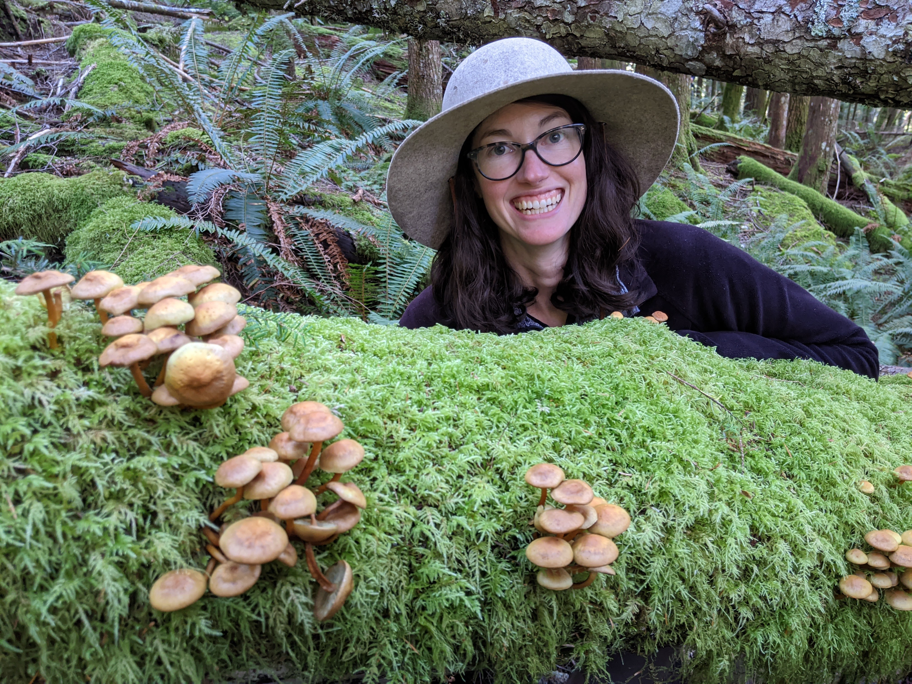

```{r setup, include=FALSE}
knitr::opts_chunk$set(echo = TRUE)
```

{width=75%}


## About Me

#### Background

Hello! My name is Emily, and I am a first year PhD student in the Biostatistics department. I grew up in West Virginia^[Fun Fact #1], but have moved around a lot for school and work. I have a bachelor's degree in biology, with a minor in math, from Bowdoin College, and a master's degree in oceanography^[Fun Fact #2] from the University of Hawai'i at Manoa. For my master's, I used population genetics and biophysical ocean modeling to understand connectivity among [copepods](https://kimberlyandrews.net/wp-content/uploads/2015/02/halopic_1.png) in the Atlantic Ocean (a labmate and I took that photo on a research cruise!^[Fun Fact #3]). Since college I've enjoyed using math to explore biological questions, but this project exposed me to genetics and taught me how to combine different methods to investigate a problem from multiple angles. I was hooked.  
<br>

#### Relevant Experience

Since obtaining my master's, I have worked as a research scientist in genetics and/or modeling groups. Informally - through  workshops, online classes, and mostly lots of practice! - I have built my programming skills in R, Matlab, bash, and even a bit of Fortran^[Fun Fact #4]. I have used different types of statistical models (e.g., (generalized) linear models, generalized additive models) as well machine learning methods and dynamical numerical models to investigate various ocean-related questions. One big question that I often think about is climate change^["Fun" fact #5] and how it will impact ecosystems, including humans, as it worsens. This [climate interventions simulator, called EN-ROADS](https://en-roads.climateinteractive.org/scenario.html?v=22.8.0), is a neat way to explore how (or if?) we can curb emissions to attain our climate goals.  
<br>

#### Research Interests

As researchers, we have a *lot* of health data available, and more is being collected everyday. Broadly, I'm interested in how we can make sense of big data to improve people's quality of life. More specifically, I'd like to tease apart how genetics and environmental factors influence disease risk to help empower individuals and the medical field about ways to prevent disease. In the event that disease occurs, I also want to learn more about how precision medicine can be used to implement individualized care. As a new PhD student, though, I plan to keep my eyes and ears open for new topics that spark my curiosity.  
<br>

#### Learning Goals

I would like to beef up my statistical coding and visualization in R, as well as improve my organization skills, including documentation in rmarkdown and version control in git, to make my research more reproducible. 
<br>
<br>
